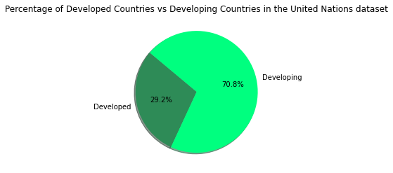

# International_Power_Rangers

## Who is the real Powerhouse? 

### An explorative analysis of global energy production by Nick, Mike, Aline & Carly

### Topic Elaboration:
It’s a power-hungry world that we live in. Everyone uses power to live but how do we make it? 

The answer is power plants, and lots of them! 

In this analysis we will take dive into how the world produces its power. Who produces the most and who is the cleanest? We will see how developed countries stack up against developing in their production and their sustainability? And what does this data tell us in perspective of the current global energy crisis?

#### Data Type: International Energy Sector
* Base Data Source: https://datasets.wri.org/dataset/globalpowerplantdatabase

* 2nd Data Source: https://data.worldbank.org/indicator/NY.GNP.PCAP.CD 
* 2nd Data Source further info: UN classifications for bins: https://www.un.org/en/development/desa/policy/wesp/wesp_current/2014wesp_country_classification.pdf

## Questions:

  * What are the most commonly used power sources globally?
  * Do developing or developed nations produce more power per capita?
  * Do developing or developed nations use more renewable or non renewable energy sources?
  * Google API plot energy plants

## Summary of Findings:

### What are the most commonly used power sources globally?
Hydro and Solar were the two most predominant fuel sources for power plants for both developing and developed countries.

The top 3 fuel sources for power plants globally were all renewable sources.  (Solar: 30.6%, Hydro: 20.5% and Wind: 15.3%)

Coal, Gas and Oil combined made up less the 25% of global power plant fuel sources which means Solar alone is used 5% more than these world-wide as a fuel source for powerplants.

### Do developing or developed nations produce more power per capita?

The 10 countries that produce the most power per person are all developed countries, whereas the 10 countries that produce the least amount of power per person are all developing countries. 

The power gap between developing and developed countries is incontestably evident when we measure the spread of the for Developed and Developing Countries Combined Power Plant Capacity (MW per Year) Per Capita data. 

Our statistical analysis indicates that for Developing Countries, having a power capacity per person over just 11.652 K/w per year would be considered an outlier, which is even lower than the median power capacity per person in a developed country, being 13.298 K/w per year.

There is positive correlation between a countries power production capacity and the countries gross national income. Positive meaning that as we see a rise in the counties GNI, we also see a rise in the countries power production capacity. We can confidently identify this as a correlation, as there is a clear association between the two variables, however we are not able to conclusively identify a causation.

When taking this data and understanding what the power production per person per year translates to in everyday life, we can look at the extremes and the medians for both country statuses:

* Iceland (Identified as a developed country) produces the most power per capita per year, coming in at a whopping 59.399 M/w per person per year.
* Palestine (Identified as a developing country) produces the least power per capita per year, at just 0.014 M/w per person per year (this is only 14kw per person per year).
* The median power production capacity per person per year in a developed country is 13.298 M/w.
* The median power production capacity per person per year in a developing country is 1.732 M/w.

One M/w can power two 60-watt lightbulbs non-stop for a year, it can drive an electric vehicle almost 5,800km, or it can power the average American home for 1.2 months. When each person in a developed country has an average of approximately 13 of these M/w up their sleeve each year, the luxuries of modern comforts are significantly more accessible compared to each person in a developing country who has on average less than 2 M/w per year to utilise.

To truly understand what the power capacity per person per year looks like in Palestine, we can convert the M/w into K/w (kilowatts). There are 1,000K/w in a M/w, so that would mean the average power per person per year in Palestine is 14kw per person per year. 1 K/w can run the average ceiling fan for 20 hours, so 14K/w would run the fan for 280 hours, which is less than 12 days.

### Do developing or developing nations use more renewable or non-renewable energy sources?

Comparing developed and developing countries primary fuel source shows that both developed and developing countries rely majorly on renewable sources as primary fuel. Developed countries have a higher use of renewable energy than developing Countries.

Developed countries have more than double the number of solar plants compared to developing countries. This trend is also seen throughout the other renewable fuel sources.

### Google Map APIs

#### Comparing the two most popular renewable energy sources comparing devolving with developed countries

The two most popular renewable power sources for developed Countries are hydro and solar power plants. Looking at the map of developed countries comparing hydro and solar power as energy use the number of hydro power plant is more widely spread in terms of land mass than solar, even though solar has the high number of power plants. Comparing Europe and the US indicates an even balance between hydro and solar power plants. Comparing Australia with Europe and the US shows that Australia is mainly reliant on hydro power plants.

The two most popular renewable power sources are also hydro and solar power. Developing countries also indicate a wider spread of hydro power plants, whereas solar plants are condensed to specific regions.

Comparing the two most popular Non-renewable energy sources comparing devolving with developed countries.

#### Comparing the two most popular non-renewable energy sources comparing devolving with developed countries

The two most popular non-renewable power sources for develop countries are gas and oil. In terms of territory gas power plants are more widely spread whereas oil power plants are condensed to specific regions.

The two most popular non renewable energy sources in developing countries are coal and gas. Coal power plants are more widely spread than gas power plants.

### Conclusion

Overall, it seems that the world has moved towards producing energy more sustainably by using more renewable fuel sources to run their power plants. 

Looking at the current global power shortages, will what we have been doing so far be enough for everyone to keep using power as we currently do?

Taking the current global power shortage into consideration brought on by over consumption, overpopulation, poor infrastructure, unexplored renewables, waste of energy, wars and instability and natural disasters to only name a few of the causes.

Will, what we have been doing so far, be enough for everyone to keep using power as we currently do? Or do we need to rethink our relationship with power consumption?
